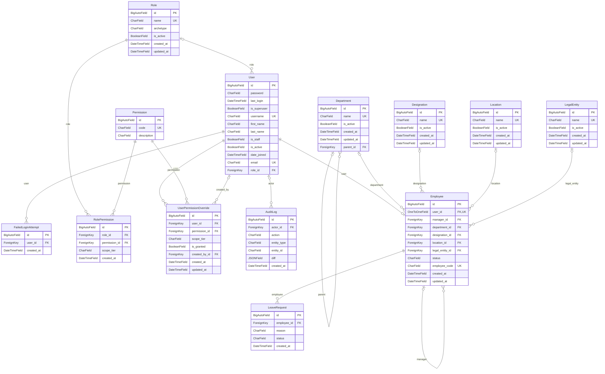

# Database

PostgreSQL 17. Local development uses a dedicated cluster in `backend/.pgdata` on
**port 5433** (see `pgdev.sh` and the Postgres section of `README.md`). The schema
is defined by the Django models and created by migrations; this page is a map of it.

## Tables

The project's own tables (Django's admin, session and JWT-blacklist tables are
framework internals and are left out of the diagram).

| Table | What it holds |
|---|---|
| `employees_employee` | One row per person. `manager_id` points at another employee (the reporting line). Links to department, designation, location, legal entity, and to the person's login (`user_id`). `status` is `active`, `on_leave` or `exited`. |
| `employees_department` | Departments; `parent_id` gives the two-level hierarchy. |
| `employees_designation`, `employees_location`, `employees_legalentity` | Job titles, locations, legal entities (one entity today). |
| `accounts_user` | The login: email, password hash, `is_active`, and the person's single `role_id`. |
| `accounts_role` | Roles. Admin-created; four starter roles plus custom ones (`archetype` tells the frontend which UI to render; `is_active` off means the role grants nothing). |
| `accounts_permission` | Permission codes such as `employees.read`. Declared in code by the owning module (`<app>/rbac.py`), never typed in by hand. |
| `accounts_rolepermission` | Which role holds which permission, and at which **scope tier** (`self`, `manager`, `team`, `department`, `location`, `legal_entity`, `all`). |
| `accounts_userpermissionoverride` | A grant or explicit deny for one person, which always wins over their role. |
| `accounts_failedloginattempt` | Failed sign-ins, used for account lockout. |
| `audit_auditlog` | Append-only record of who did what. Nothing updates or deletes it. |

Access decisions are made from `accounts_rolepermission` (or an override) plus the
`employees_employee` relationships; there is no other access table.

## Diagram

Renders on GitHub and in most Markdown viewers. Regenerate any time with
`python manage.py show_schema --mermaid`.



## Looking at the data

Pick whichever suits you. None of them changes anything except the admin site.

**1. The terminal (nothing to install).** Lists every table with its columns, keys
and live row counts:

```bash
python manage.py show_schema --counts
```

To see how access is actually configured right now (who holds what, at which scope):

```bash
python manage.py access_matrix employees.read
```

**2. The Django admin site (browse and edit rows in a browser).** Needs a staff
login, created once with a password you choose:

```bash
python manage.py createsuperuser
python manage.py runserver 0.0.0.0:3000
```

Then open <http://localhost:3000/admin/>. Employees, users, roles (with their
permissions inline), permissions, overrides and the audit log are all registered;
the audit log is read-only there.

**3. pgAdmin (a proper database browser).** Installed with Postgres at
`C:\Program Files\PostgreSQL\17\pgAdmin 4\runtime\pgAdmin4.exe`. Add a server with
host `localhost`, port `5433`, database `hrms`, and the username and password from
`POSTGRES_USER` / `POSTGRES_PASSWORD` in `backend/.env`. DBeaver or any other
Postgres client works with the same details.

**4. psql (SQL in the terminal).**

```bash
python manage.py dbshell
```

Handy queries:

```sql
-- who holds what, at which scope
select r.name as role, p.code, rp.scope_tier
from accounts_rolepermission rp
join accounts_role r on r.id = rp.role_id
join accounts_permission p on p.id = rp.permission_id
order by r.name, p.code;

-- the most recent audit entries
select created_at, action, entity_type, entity_id from audit_auditlog
order by id desc limit 20;
```

The dev database contains real employee records (this repository is public, so
they are never committed). Treat anything you copy out of it accordingly.
