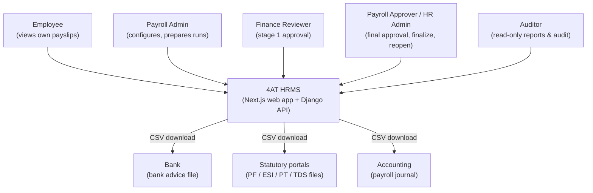
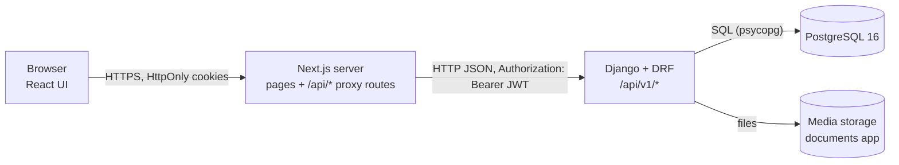
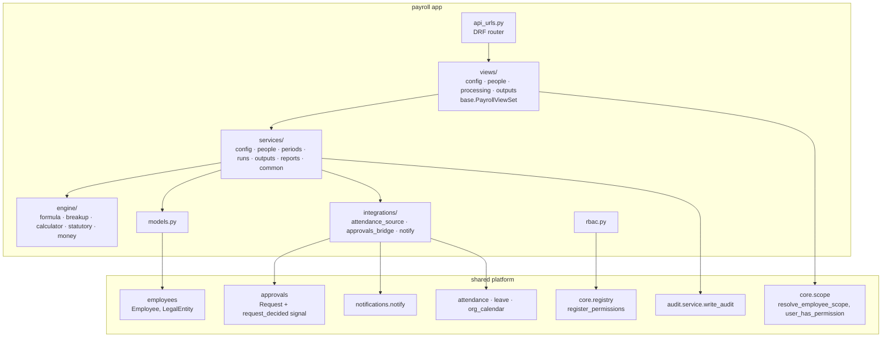
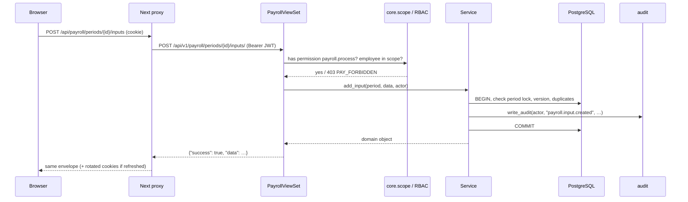
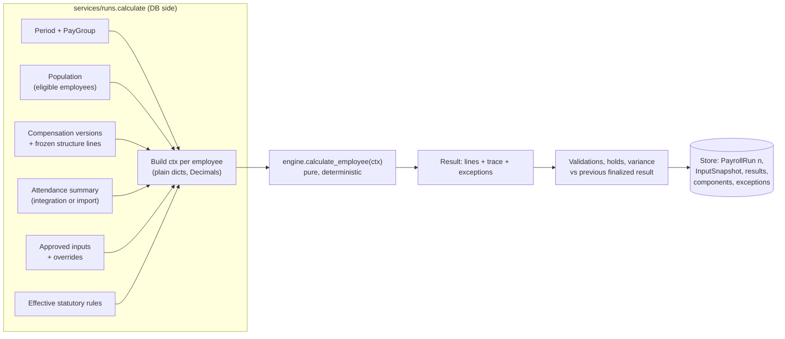
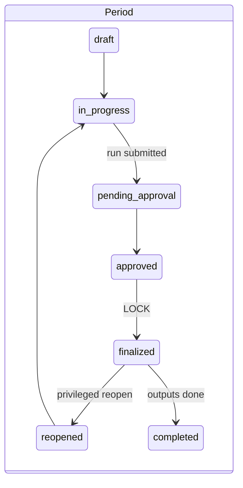
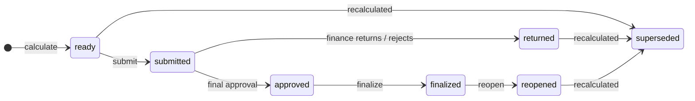
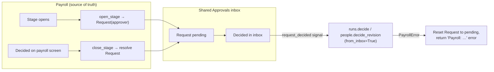
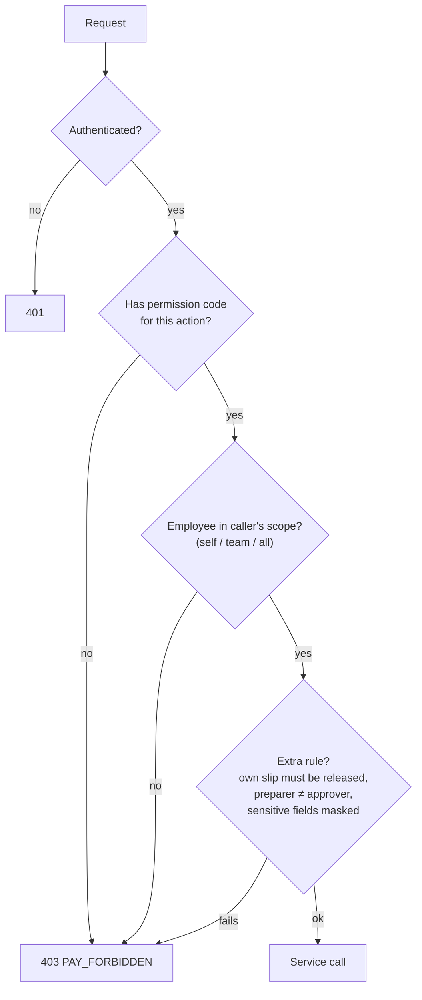
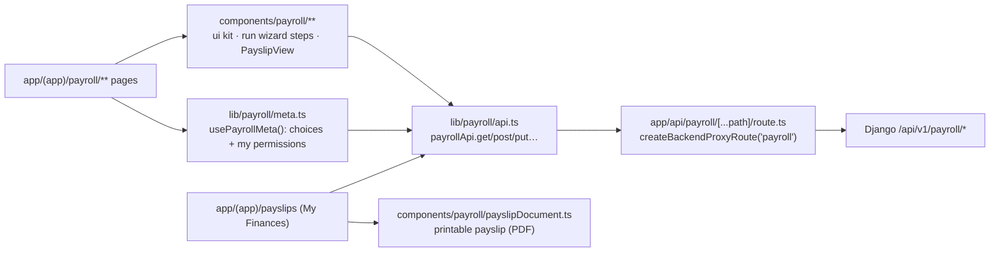

# Payroll Module — Architecture

> Companion to `PAYROLL-ARCHITECTURE.html` (same content with rendered diagrams). This Markdown
> file is the canonical copy for coding agents — edit it, then run
> `node docs/payroll/build-html.mjs` to regenerate the HTML. For the runbook, UAT status,
> troubleshooting and feature detail see `PAYROLL-MODULE.md`.

## 1. Purpose and scope

The payroll module turns configuration (components, structures, statutory rules), people data
(employees, compensation) and monthly inputs (attendance, leave, bonus, OT, deductions) into an
**approved, locked, auditable payroll** and its outputs (payslips, bank advice, statutory files,
journal, reports).

Architectural goals, in priority order:

1. **Correctness & reproducibility** — the same inputs always produce the same result; any past
   payslip can be re-explained line by line.
2. **Control** — nothing becomes official without maker-checker approval; finalized payroll
   cannot change except through a privileged, audited reopen.
3. **Least privilege** — every read and write is permission- and scope-checked on the server.
4. **Fit the HRMS platform** — reuse the shared primitives (RBAC, audit, approvals,
   notifications, documents, attendance) instead of re-inventing them.
5. **Simplicity** — a modular monolith; no queues, services or engines beyond what the
   requirements need.

---

## 2. System context

External systems receive **files downloaded by payroll staff**; there are no outbound API
integrations in v1.

---

## 3. Containers

| Container | Tech | Responsibility |
|---|---|---|
| Browser | React (Next.js client components), Tailwind | Payroll screens, employee My Finances; UI permission gating only |
| Next.js server | Next.js 16 route handlers | Holds auth cookies (HttpOnly), converts them to a Bearer token, refreshes on 401, forwards to Django (`frontend/src/lib/api/proxy.ts`) |
| Django API | Django 5.1, DRF, SimpleJWT | All business rules, authorization, persistence, audit |
| PostgreSQL | 16 (`backend/docker-compose.yml` for local dev, host port 5433) | System of record; row locks for finalize |
| Media storage | Local disk / object storage | Uploaded documents (documents primitive) |

The browser never sees the JWT: the proxy keeps tokens server-side, which removes a whole class
of XSS token-theft risk.

---

## 4. Components inside Django

### Layer contracts

| Layer | May do | Must not do |
|---|---|---|
| **views** | Authenticate, check permission codes, resolve scope, parse/validate request, call one service, shape the envelope, handle idempotency | Contain business rules or state transitions |
| **services** | Business rules, state machines, transactions and row locks, period-lock and version checks, audit writes, call engine and integrations | Know about HTTP / DRF request objects |
| **engine** | Pure calculation over plain dicts / Decimals | Touch the database, time, or globals |
| **integrations** | Adapt other modules to payroll's needs (read attendance, mirror approvals, send notifications) | Own payroll rules — they call back into services |
| **models** | Schema, constraints, simple properties | Cross-entity workflows |

Dependencies point **downwards only** (views → services → engine). The engine imports nothing
from Django, which is why it is unit-tested in isolation and reusable for previews.

---

## 5. Request lifecycle (read and write)

Cross-cutting behaviour applied on this path:

| Concern | Where | How |
|---|---|---|
| Authentication | Django `JWTAuthentication`; Next proxy | Bearer token from HttpOnly cookie; transparent refresh on 401 |
| Authorization | `views/base.py::PayrollPermission` | `required_permission` / `action_permissions` / `any_permissions` per action (codes from `rbac.py`) |
| Data scope | `PayrollViewSet.scope_ids`, `employee_in_scope` | `resolve_employee_scope(user, code)` → self / team / all |
| Errors | `services/common.py`, `PayrollViewSet.handle_exception` | Uniform `{"success": false, "error": {code: "PAY_*", message, details}}` |
| Idempotency | `PayrollViewSet.idempotent` + `IdempotencyRecord` | Same `Idempotency-Key` + scope replays the stored response |
| Concurrency | `TrackedModel.version`, `select_for_update` | Optimistic `PAY_VERSION_CONFLICT`; row locks when finalizing |
| Period lock | `services/common.py::ensure_unlocked` | Any write on a finalized period → `409 PAY_PERIOD_LOCKED` |
| Audit | `audit.service.write_audit` | Append-only log entry with actor, entity, before/after for every mutation |
| Transactions | `@transaction.atomic` on every mutating service | All-or-nothing, e.g. finalize locks every result or none |

---

## 6. Calculation architecture

- **Gather once, calculate purely.** The service reads everything a run needs, freezes it into an
  `InputSnapshot`, then calls the engine per employee with plain data. The engine never queries.
- **Deterministic:** `ENGINE_VERSION` is stored on each run; same context ⇒ same output, so a run
  can be re-explained or re-computed for audit.
- **Append-only runs:** a recalculation writes run *n+1* and supersedes the previous draft; a
  finalized run is immutable.
- **Trace:** every component line stores source, rule/structure version, formula, inputs and the
  rounded value — the trace screen reads it; nothing is recomputed on display.
- **Extensibility:** new statutory rules are data (`StatutoryRule` params); new formula variables
  are added in `engine/formula.py` context building; the attendance source is swappable
  (`attendance.payroll_provider` if present, else `payroll.integrations.attendance_source`, else
  manual import).

---

## 7. Workflow & state architecture

- State transitions live **only** in `services/runs.py` and `services/people.py`; each checks the
  current state and raises `PAY_INVALID_STATE` otherwise.
- Maker-checker is structural: submit (`payroll.process`), Finance Review (`payroll.review`),
  Final Approval (`payroll.approve`), finalize (`payroll.finalize`) and reopen (`payroll.reopen`)
  are separate permissions, and the preparer is always excluded from approving.

### Integration with the shared approvals inbox

Payroll is multi-stage; the shared engine is single-approver. The bridge
(`integrations/approvals_bridge.py`) **mirrors** each pending payroll stage as one
`approvals.Request`:

Payroll remains the source of truth: an inbox decision is applied **through payroll's own
service**, so maker-checker, permissions and audit still apply; if payroll refuses, the inbox
request is rolled back so both sides agree.

---

## 8. Data architecture

| Group | Tables | Notes |
|---|---|---|
| Configuration | `PayGroup`, `SalaryComponent` (+`Version`), `SalaryStructure` (+`Component`, `Version`), `StatutoryRule` | Effective-dated, versioned; `TrackedModel` gives `version` + created/updated by/at |
| People | `EmployeePayrollProfile`, `CompensationRevision`, `EmployeeCompensation`, payment/statutory info, loans | Compensation versions never overlap; revision approval closes the prior version |
| Processing | `PayrollPeriod`, `AttendancePayrollInput`, `PayrollInput`, `PayrollEmployeeAction`, `PayrollOverride` | All writes blocked when the period is locked |
| Results | `PayrollRun`, `InputSnapshot`, `EmployeePayrollResult`, `PayrollResultComponent`, `PayrollException`, `PayrollApproval` | Append-only per run; one current run per period |
| Outputs | `Payslip`, `PayrollOutput` | Versioned; regeneration supersedes |
| Infrastructure | `IdempotencyRecord` | Stored responses for retried POSTs |

Ownership boundaries: payroll **reads** `employees.Employee`, attendance, leave and calendar data
but never writes them; other modules never write payroll tables. Money columns are `Decimal`
(`max_digits` sized for INR), never floats.

---

## 9. Security architecture

- **Defence in depth:** UI hides what a user can't do, but every rule is enforced server-side;
  tests call endpoints directly as each role (`test_rbac_matrix.py`).
- **Self-service isolation:** `/my/*` endpoints derive the employee from the token, never from
  the URL, and filter `employee = me AND status = released` in one query.
- **Sensitive data:** bank / PAN / UAN masked unless `payroll.sensitive.read`; payslips show
  last 4 digits only; employer-cost lines never appear on employee payslips.
- **Documents:** permission grants for employee-owned files are scope-checked (fixes a
  cross-employee payslip-document read found during UAT).
- **Audit:** every mutation (including report exports and output downloads) is logged; reopen
  requires a reason, which is stored.
- **No dynamic code:** formulas are parsed by a whitelist AST evaluator — never `eval`.

---

## 10. Frontend architecture

- Screens follow the UI Design Reference 1:1 and use only the payroll UI kit (no reuse of older
  payroll screens).
- `usePayrollMeta()` fetches choice lists and the caller's permission codes once (cached) for
  gating buttons; the sidebar's Payroll entry needs one of the staff permissions.
- The run wizard is URL-driven (`/payroll/run/<periodId>?step=…`) so every step is linkable and
  reload-safe; read-only mode is derived from permissions + period lock.
- The proxy adds a trailing slash for DRF routers (payroll) and omits it for routers built
  without (`attendance`, `leave`, `calendar`, `requests`).

---

## 11. Deployment view

| Environment | Composition |
|---|---|
| Local dev | `next dev` (port 3001) → `manage.py runserver` (8000) → Postgres 16 on 5433 (local install or `backend/docker-compose.yml`); SQLite fallback when `POSTGRES_HOST` is unset |
| Tests | `pytest --ds=config.settings.test` against Postgres (`hrms` database) |
| Production (planned) | Next.js server + Django + managed Postgres; secrets from environment, never in the repo. Note: `backend/Dockerfile` currently starts `manage.py runserver` — switch to a WSGI server (e.g. gunicorn) before go-live |

Everything is synchronous in-request: a monthly run for the current headcount calculates in
seconds. If headcount grows enough that calculation exceeds request time limits, the calculate
service is already isolated behind one function and can be moved to a background worker without
changing the engine or the API contract (return the run in `calculating` state and poll).

---

## 12. Key architecture decisions

| # | Decision | Alternatives considered | Why |
|---|---|---|---|
| AD-1 | Modular monolith app inside the existing Django project | Separate payroll service | Shares auth, RBAC, audit and DB transactions; far less operational cost |
| AD-2 | Pure calculation engine over plain data | ORM-driven calculation | Determinism, reproducibility, DB-free unit tests, preview reuse |
| AD-3 | Decimal-only money with configured rounding points | Floats, round at end | Avoids paisa drift; matches Calculation Rules §9 |
| AD-4 | Versioned config + append-only runs + superseded outputs | Update in place | Past payroll must stay explainable; audit and compliance |
| AD-5 | Separate permission per approval stage | Single "payroll admin" role | Maker-checker enforced by construction |
| AD-6 | Mirror stages into shared approvals inbox | Replace with engine / separate inbox | Keeps payroll's multi-stage rules while approvers use one inbox |
| AD-7 | Statutory values as effective-dated data | Hard-coded rates | Laws and state slabs change; no deploy needed |
| AD-8 | Unmarked attendance = pending, not absent | Treat as LOP | Never silently cut pay |
| AD-9 | Next.js proxy holds tokens in HttpOnly cookies | Tokens in browser storage | XSS cannot steal tokens |
| AD-10 | Copy (not merge) features from in-progress branches | Merge branches | Keeps teammates' work unaffected until the planned merge to main |
| AD-11 | Payslip PDF rendered client-side from the scope-checked API payload | Server PDF library | No new dependency and no second data path to secure; server PDF can be added for emailing later |

---

## 13. Known architectural limits

- Calculation is synchronous (fine for current headcount — see §11 for the scale-out path).
- No outbound integrations (bank / statutory / accounting are file downloads).
- Payroll keeps its own payment-info tables until the organization branch's `BankDetails` /
  `IdentityDocument` are merged and can be adopted.
- One role per user in the platform RBAC: payroll-only roles lack employee self-service.
- Mermaid diagrams in the HTML load from a CDN; offline, the diagram source text is shown.
