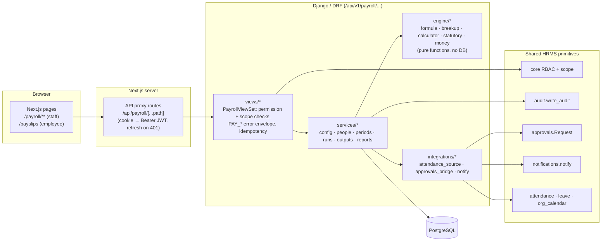
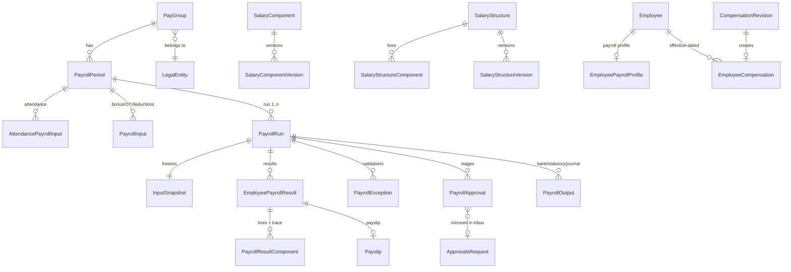
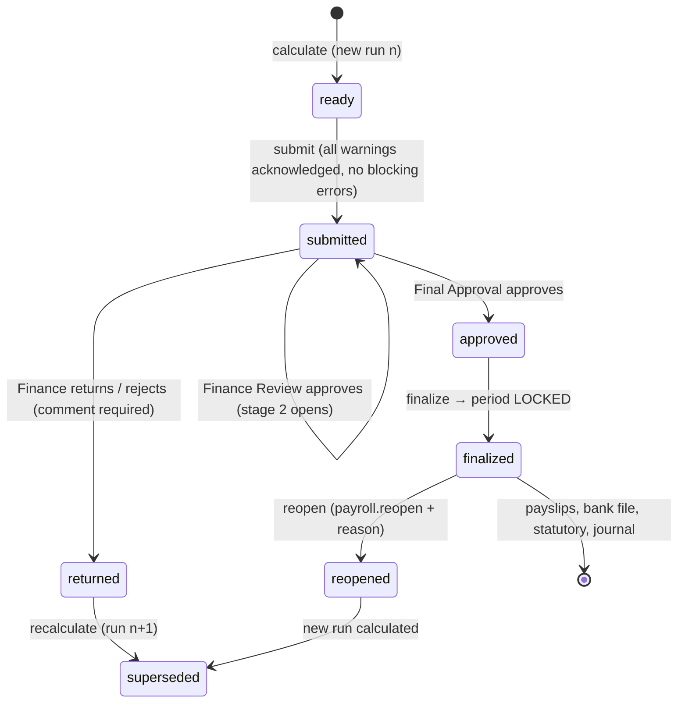
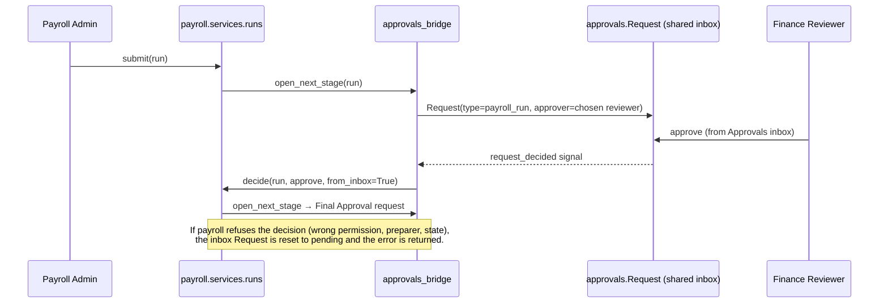

# Payroll Module — Architecture, Runbook & Decisions

> Companion to `PAYROLL-MODULE.html` (same content, with rendered diagrams, for human
> readers). This Markdown file is the canonical copy for coding agents — edit it, then run
> `node docs/payroll/build-html.mjs` to regenerate the HTML. The deeper architecture view
> (containers, layers, request lifecycle, security, decisions) is in `PAYROLL-ARCHITECTURE.md`.

- **Branch:** `payroll_module` (standalone; not merged with other feature branches — see §11)
- **Specs implemented:** PRD v1.0, Calculation Rules v1.0, API & Backend Contract v1.0,
  Jira Backlog/UAT v1.0 (PAY-001..022, UAT-001..016), UI Design Reference (screens 01–12)
- **Backend:** `backend/payroll/` (Django 5.1 + DRF) · **Frontend:** `frontend/src/app/(app)/payroll/**`,
  `frontend/src/components/payroll/**`, `frontend/src/lib/payroll/**` (Next.js 16)

---

## 1. What the module does

Monthly payroll for 4AT's India entities, end to end:

1. **Configure** salary components (formula-based), salary structures (CTC breakup), pay groups
   and effective-dated statutory rules (PF, ESI, PT, LWF, TDS, Gratuity).
2. **Assign compensation** to employees and revise it through maker-checker approval, keeping
   every historical version.
3. **Run payroll** per period through a 7-step wizard: attendance → joiners/exits →
   revisions/bonus/OT → reimbursements/deductions → holds/arrears/adjustments → statutory → review.
4. **Calculate** with a deterministic, Decimal-only engine that stores a per-line trace.
5. **Approve** (Finance Review → Final Approval), **finalize & lock**, **reopen** with reason.
6. **Produce outputs**: payslips (released to employees), bank advice, statutory reports,
   journal, register, variance report and a full audit trail.

Employees see only their own released payslips (My Finances → My Pay), and can download them as
PDF or Excel.

---

## 2. Architecture



**Layering rule:** views only authorize and shape responses; services hold every business rule
(state transitions, locking, maker-checker, audit); the engine is pure and deterministic (same
input → same output), so it is unit-tested without a database and results are reproducible.

### Code map

| Path | Responsibility |
|---|---|
| `payroll/models.py` | Data model (§3). `TrackedModel` adds created/updated by/at + optimistic `version`. |
| `payroll/rbac.py` | Permission codes and default role grants (§8). |
| `payroll/engine/money.py` | Decimal helpers; money is never a float, 4 dp until rounding point. |
| `payroll/engine/formula.py` | Safe AST formula evaluator (whitelisted nodes, no `eval`). |
| `payroll/engine/breakup.py` | CTC → monthly/annual component breakup with balancing component. |
| `payroll/engine/calculator.py` | `calculate_employee(ctx)` — the 10-step calculation + trace. |
| `payroll/engine/statutory.py` | Generic PF/ESI/PT/LWF/TDS/Gratuity shapes; values come from `StatutoryRule`. |
| `payroll/services/config.py` | Components & structures, immutable version snapshots. |
| `payroll/services/people.py` | Payroll profile, compensation assignment & revisions (maker-checker). |
| `payroll/services/periods.py` | Periods, wizard steps, attendance snapshot, inputs, OT, joiners/exits, holds, overrides. |
| `payroll/services/runs.py` | Calculate → validate → submit → approve → finalize → reopen. |
| `payroll/services/outputs.py` | Payslips, bank advice, statutory files, journal (finalized runs only). |
| `payroll/services/reports.py` | Dashboard + MVP reports (register, variance, statutory, audit trail…). |
| `payroll/services/common.py` | `PAY_*` errors, audit helper, version checks, period locks. |
| `payroll/integrations/attendance_source.py` | Reads attendance/leave/calendar into payroll's attendance summary. |
| `payroll/integrations/approvals_bridge.py` | Mirrors payroll approval stages into the shared Approvals inbox. |
| `payroll/integrations/notify.py` | Payslip-released / run-finalized notifications. |
| `payroll/views/*` | DRF viewsets (config, people, processing, outputs). `base.py` = auth/scope helpers. |
| `payroll/api_urls.py` | Router (mounted under `/api/v1/`). |
| `payroll/management/commands/seed_payroll.py` | Seeds pay group, components, structure, statutory rules; `--demo` adds demo users/employees. |
| `payroll/management/commands/verify_payroll.py` | RBAC conformance check for the payroll endpoints. |
| `frontend/src/lib/payroll/api.ts` | Typed fetch wrapper for `/api/payroll/*`. |
| `frontend/src/lib/payroll/meta.ts` | `usePayrollMeta()` — choice lists + caller's permissions (UI gating only). |
| `frontend/src/components/payroll/ui.tsx` | Shared payroll UI kit (cards, tables, badges, formatters, CSV). |
| `frontend/src/components/payroll/run/*` | Run-payroll wizard steps. |
| `frontend/src/components/payroll/PayslipView.tsx` | Payslip screen (UI 06) for staff and employees. |
| `frontend/src/components/payroll/payslipDocument.ts` | Standalone printable payslip (PDF download). |

### Frontend routes

| Route | Screen | Who |
|---|---|---|
| `/payroll` | Dashboard (UI 01) | payroll staff |
| `/payroll/run`, `/payroll/run/<periodId>?step=…` | Run wizard (UI 02–05, 07–08) | preparer; reviewers read-only |
| `/payroll/configuration?tab=components\|structures\|history\|pay-groups\|statutory` | Configuration (UI 09–10) | `payroll.manage` (others read-only) |
| `/payroll/configuration/structures/<id\|new>` | Structure builder | `payroll.manage` |
| `/payroll/compensation`, `/payroll/compensation/<employeeId>[?tab=profile\|loans]`, `/assign` | Employee compensation (UI 11) | `payroll.write` |
| `/payroll/approvals` | Payroll approvals queue | reviewers / approvers |
| `/payroll/reports[?tab=audit]` | Reports & audit (UI 12) | `payroll.audit` / run readers |
| `/payroll/payslips/<id>` | Payslip (staff view) | run readers |
| `/payslips?tab=pay`, `/payslips/view/<id>` | My Finances → My Pay, own payslip | every employee |
| `/payroll-setup`, `/payroll-inputs` | Legacy URLs → redirect into `/payroll/*` | — |

The sidebar **Payroll** entry is shown only to users holding one of the 8 staff permissions
(`PAYROLL_STAFF_PERMISSIONS` in `meta.ts`). UI gating is convenience only — the backend enforces
every permission.

---

## 3. Data model



Key rules:

- **Nothing a past payroll depended on is overwritten.** Components and structures write
  immutable version rows; a component change re-versions active structures from the change date.
- **Compensation is effective-dated.** An approved revision closes the old version the day before
  the new `effective_from` (e.g. v1 ends 30 Sep, v2 starts 1 Oct).
- **Runs are append-only.** Recalculation creates run *n+1* and supersedes the draft; a finalized
  run is never modified — reopen marks it and its outputs `superseded`.
- `PayrollRun` freezes its inputs in an `InputSnapshot` so a result can always be re-explained.
- Statuses — **Period:** draft → in_progress → ready_for_review → pending_approval → approved →
  finalized (locked) → reopened / completed. **Run:** created → calculating → calculated /
  validation_failed → ready → submitted → approved / returned / rejected → finalized → reopened /
  superseded. **Payslip:** generated → released → superseded.

---

## 4. Monthly payroll lifecycle



Wizard steps (`services/periods.py::STEPS`): `attendance`, `joiners_exits`, `revisions_variable`,
`reimbursements`, `holds_adjustments`, `statutory`, `review` (+ `finalize`, `completed` screens).

Pipeline (`services/runs.py`): **open period → snapshot inputs → validate → calculate → store
run/results → review → approve → finalize/lock → generate outputs.**

Guards enforced in services:

| Guard | Error |
|---|---|
| Any write to a finalized/completed period | `409 PAY_PERIOD_LOCKED` |
| Stale `version` on update | `409 PAY_VERSION_CONFLICT` |
| Submit with blocking errors or unacknowledged warnings | `422 PAY_BLOCKING_VALIDATION` |
| Wrong state for an action (e.g. finalize an unapproved run) | `409 PAY_INVALID_STATE` |
| Preparer approving own run; approver not holding the stage permission | `403 PAY_FORBIDDEN` |
| Duplicate import row / same source key | `PAY_DUPLICATE_INPUT` |
| Retried POST with same `Idempotency-Key` | returns the original response, no second run |

---

## 5. Calculation engine

`engine/calculator.py::calculate_employee(ctx)` is a pure function over plain data (Calculation
Rules §2 canonical sequence):

1. **Eligibility & payable window** — period ∩ [joining / payroll start, exit / payroll end].
2. **Compensation segments** — the effective compensation version(s) in the window; a mid-period
   revision splits the month into segments (policy per pay group).
3. **Monthly reference amounts** — from the structure breakup of each segment's annual CTC.
4. **Proration** — per pay group basis: `calendar`, `working`, or `fixed_30`; only components
   flagged proratable are prorated.
5. **LOP** — loss-of-pay days reduce payable days for LOP-affected components.
6. **Variable inputs** — approved bonus, OT (units × rate), reimbursements, arrears, adjustments.
7. **Statutory deductions** on actual earned wages — PF, ESI, PT, LWF, TDS.
8. **Other deductions** — loan recovery, recoveries, ad-hoc deductions.
9. **Employer contributions** — PF/ESI/LWF employer, gratuity (not on the employee payslip).
10. **Validations** — employee-level exceptions (missing structure, negative net, attendance not
    final, variance > threshold, …).

Then **overrides** (Calc Rules §10: calculated value kept, override applied with mandatory reason
and `payroll.override`) and **rounding** (component rounding, then pay-group net-pay rounding).

Supporting pieces:

- **Money:** `Decimal` everywhere, 4 dp internally, rounded only at each component's rounding point.
- **Formulas** (`engine/formula.py`): numbers, component codes, `CTC`, `CTC_M`, `GROSS`, `PD`,
  `WD`, `LOP`, `U`, `RATE`; `+ - * / ( )`, comparisons, `a if c else b`, `min max round abs floor ceil`.
  Parsed with `ast`; unknown nodes/names are rejected at save time (`UAT-002`); cycles →
  `PAY_CIRCULAR_REFERENCE`.
- **Breakup** (`engine/breakup.py`): resolves components in dependency order; one *balancing*
  component absorbs the remainder so the breakup reconciles exactly to CTC (fixed-point iteration
  when statutory employer costs depend on the balancing amount). Over/under → `PAY_CTC_EXCEEDED` /
  `PAY_CTC_MISMATCH`.
- **Statutory values** come only from effective-dated `StatutoryRule` rows. The seeded rules are
  **placeholders flagged "NOT compliance-reviewed"** — each run raises a warning until reviewed.
- **Trace:** every result line stores source, rule/structure version, formula, inputs and rounded
  result — `GET /payroll/results/<id>/trace/` (UAT-009).
- **Variance:** each result is compared with the employee's previous finalized result; a change
  above `PayGroup.variance_threshold_pct` (default 10%) raises `NET_PAY_VARIANCE` with previous,
  current, change %, and the component drivers (UAT-011).

---

## 6. Attendance source

`integrations/attendance_source.py` (used automatically when `attendance`, `leave` and
`org_calendar` apps are installed; otherwise attendance is imported/keyed in):

- Week-offs and holidays (org_calendar) are never working days.
- Approved leave: paid or unpaid per `LeaveType.is_paid`; single-day half-day = 0.5.
- `absent` → LOP; `half_day` → ½ present + ½ LOP.
- **An unmarked working day is not assumed absent**: the row becomes `pending` and payroll raises
  `ATTENDANCE_NOT_FINAL` instead of silently cutting pay (UAT-005).
- OT hours from attendance overtime feed the OT input generator (timesheets are approximated by
  attendance overtime — see §13).

---

## 7. Approvals (maker-checker) and the shared inbox

Stages: **Finance Review** (`payroll.review`) → **Final Approval** (`payroll.approve`) for both
payroll runs and compensation revisions. The preparer can never approve their own item.



Approver choice (`choose_approver`): the pay group's named **Finance Reviewer / Final Approver**
(set in Configuration → Pay Groups), otherwise an active user holding the stage permission —
preferring the dedicated role (*Finance Reviewer* / *Payroll Approver*), excluding the preparer
and earlier approvers. Decisions made on the payroll screens close the mirrored inbox request, so
both sides always agree. Cancelling a revision withdraws its inbox request.

---

## 8. RBAC and data protection

| Permission | Employee | Manager | HR Admin | Finance | Payroll Admin | Finance Reviewer | Payroll Approver | Auditor |
|---|---|---|---|---|---|---|---|---|
| payroll.read | self | team | all | all | all | all | all | all |
| payroll.write | | | ✓ | ✓ | ✓ | | | |
| payroll.manage | | | ✓ | ✓ | ✓ | | | |
| payroll.process | | | ✓ | ✓ | ✓ | | | |
| payroll.review | | | | ✓ | | ✓ | | |
| payroll.approve | | | ✓ | | | | ✓ | |
| payroll.finalize | | | ✓ | | | | ✓ | |
| payroll.reopen | | | ✓ | | | | | |
| payroll.release | | | ✓ | ✓ | ✓ | | | |
| payroll.override | | | ✓ | | ✓ | | | |
| payroll.sensitive.read | | | ✓ | ✓ | ✓ | | | |
| payroll.audit | | | ✓ | ✓ | ✓ | | | ✓ |

(Defaults from `payroll/rbac.py`; admins can change grants — re-running migrate never overwrites
their changes.) Every employee-keyed query is filtered by `resolve_employee_scope(user, code)`.

**Payslip access guarantees** (verified by tests and by manual probing, §12):

- `GET /payroll/my/payslips/` and `/my/payslips/<id>/` filter by **caller's own employee +
  `status=released`** in the same query — another employee's ID returns 403.
- `GET /payroll/payslips/<id>/` (staff route) checks scope; a non-staff user can only open their
  own released slip there.
- `documents` access matrix: permission grants for employee-owned files (`payslip`,
  `id_document`, `employee_document`) are now **scope-checked** — before this fix any employee
  (who holds `payroll.read` at *self* scope) could open a colleague's payslip document.
- Bank account / PAN / UAN are masked unless `payroll.sensitive.read`; payslips show
  `XXXXXX` + last 4 digits.
- Employer-only lines (employer PF, gratuity) never appear on the employee payslip.

---

## 9. Payslips & outputs

- Outputs only from a **finalized** run (`PAY-FR-026`); each has version, period, generated
  by/at; regeneration supersedes, never overwrites.
- **Release** makes payslips visible to employees and sends a notification.
- **Employee download:** My Finances → My Pay → **Download payslip**, or open the payslip →
  **Download PDF / Download Excel**. The PDF is a standalone document
  (`payslipDocument.ts`) printed from a hidden frame (browser "Save as PDF"), containing company,
  employee, period, pay date, working/payable days, masked bank, earnings, deductions, net pay and
  amount in words — identical figures to the staff view. Excel = CSV with the same details.
- Bank advice (mark paid), statutory reports, journal and payroll register are generated from the
  Run → Completed step and Reports.

---

## 10. API

All endpoints under `/api/v1/payroll/` (trailing slash), JSON envelope
`{"success": true, "data": …}` or `{"success": false, "error": {"code": "PAY_…", "message", "details"}}`.

| Area | Endpoints |
|---|---|
| Config | `components/`, `salary-structures/` (+ preview, versions), `statutory-rules/`, `pay-groups/` |
| People | `employees/` (profile), `compensations/` (assign, revisions, decide, cancel), `loans/` |
| Self-service | `my/payslips/`, `my/payslips/<id>/`, `my/summary/` |
| Periods | `periods/` + `steps`, `readiness`, `population`, `attendance` (row, import, sync, fill-missing), `snapshot-inputs`, `inputs` (decide, import), `generate-ot`, `generate-loans`, `joiners-exits`, `employee-actions`, `overrides`, `calculate`, `complete` |
| Runs | `runs/<id>/` + `results`, `exceptions`, `submit`, `approvals`, `finalize`, `reopen`, `payslips` (generate, release), `outputs`, `checklist` |
| Results | `results/<id>/trace/`, `exceptions/<id>/acknowledge/` |
| Outputs | `payslips/`, `outputs/<id>/download/`, `outputs/<id>/mark-paid/`, `reports/`, `reports/<key>/?period=&format=csv`, `audit/`, `dashboard/`, `meta/` |

Mutating calls accept `Idempotency-Key`; updates send `version` for optimistic locking.

---

## 11. Features copied from other branches (and why copy, not merge)

The payroll branch must stay standalone while teammates' branches are still in progress, so the
features payroll depends on were **copied** (not merged) — no other branch is affected. All
branches are to be combined into `main` later.

| Source branch | Copied |
|---|---|
| `leave_attendance_module` | `backend/{approvals, attendance, leave, org_calendar}` and their frontend pages/components (approvals, attendance, leave, calendar, change-password, admin role builder, notifications dropdown) |
| `organization` | `backend/{notifications, documents}`, `audit/utils.py`, accounts migrations 0006–0009 + `provision_logins`, `employees/identity_numbers.py`, employees migrations 0005–0007, accounts/employees serializers, views, urls, rbac, settings |

Files changed on more than one branch (`accounts/auth_views.py`, `employees/models.py`,
`employees/views.py`, `core/scope.py`) were combined with a 3-way `git merge-file` (base =
`origin/main`) with 0 conflicts; `employees/migrations/0008_merge_…` joins the migration graphs.
Payroll-specific glue: `payroll/integrations/*`, `payroll/migrations/0006_approvals_engine_link.py`
(pay-group named approvers + inbox link), Suspense wrapper in `(app)/layout.tsx`, and
`createBackendProxyRoute(prefix, { trailingSlash: false })` for the attendance/leave/calendar/
requests routers (built without trailing slashes).

**When merging to main:** expect the copied files to be identical to (or newer on) their source
branches — prefer the source branch version, then re-run the full test suite.

---

## 12. Running it locally

### Database

- **PostgreSQL 16** (recommended; matches production). Local install used during development:
  `%LOCALAPPDATA%\pgsql16`, port **5433**, role `hrms`, databases `hrms` (tests) and `hrms_dump`
  (dev data restored from a private dump — **never commit the dump; it contains real PII**).
  ```bash
  "$LOCALAPPDATA/pgsql16/pgsql/bin/pg_ctl.exe" -D "$LOCALAPPDATA/pgsql16/data" -l "$LOCALAPPDATA/pgsql16/server.log" start
  ```
- `backend/.env` (git-ignored) sets `POSTGRES_HOST/PORT/DB/USER/PASSWORD`. Without `POSTGRES_HOST`
  dev settings fall back to SQLite (`db.sqlite3`).

### Backend

```bash
cd backend
.venv/Scripts/python manage.py migrate
.venv/Scripts/python manage.py seed_payroll            # config only
.venv/Scripts/python manage.py seed_payroll --demo     # + demo users & employees (prints logins)
.venv/Scripts/python manage.py runserver 8000
```

Demo logins (`*.@demo.4at`, password printed by the seed command): `payroll.admin`,
`finance.reviewer`, `payroll.approver`, `auditor`, `hr.admin`, and employees as
`<first>.<last>@demo.4at` (e.g. `nikhil.kommineni@demo.4at`). Demo data only — never use on
production.

### Frontend

`frontend/.env.local`: `BACKEND_API_URL=http://localhost:8000/api/v1`, `MOCK_AUTH=false`.

```bash
npm --prefix frontend run dev    # http://localhost:3001 (port per launch config)
```

### Tests & quality gates

```bash
cd backend
export POSTGRES_PORT=5433 POSTGRES_HOST=localhost POSTGRES_USER=hrms POSTGRES_PASSWORD=x POSTGRES_DB=hrms
.venv/Scripts/python -m pytest -q -p no:cacheprovider --ds=config.settings.test core accounts employees audit example_leave approvals notifications documents attendance leave org_calendar payroll
.venv/Scripts/python -m ruff check payroll && .venv/Scripts/python -m black --check payroll
.venv/Scripts/python manage.py verify_payroll          # RBAC conformance
cd ../frontend && npx tsc --noEmit && npm run build
```

| Test file | Covers |
|---|---|
| `payroll/tests/test_engine.py` | Formula safety, breakup/balancing, proration bases, LOP, mid-period revision, statutory, rounding, parallel-payroll reconciliation (UAT-016) |
| `payroll/tests/test_payroll_flow.py` | UAT-001/002/003/004/007/010/011/012/013/014/015 through the real API as each role |
| `payroll/tests/test_rbac_matrix.py` | Every endpoint × role allow/deny matrix |
| `payroll/tests/test_integrations.py` | Attendance source (hand-calculated month), inbox approvals both ways, approver routing, consistency when payroll refuses an inbox decision |
| `payroll/tests/test_conformance.py` | Core scoped-endpoint conformance kit |
| `documents/tests/test_documents.py` | Includes the self-scope payslip-document regression test |

### UAT status (Jira Backlog v1.0)

| UAT | Story | Status |
|---|---|---|
| 001 Create fixed earning component | PAY-001 | ✅ automated + manual UI |
| 002 Invalid total/formula blocked | PAY-002 | ✅ automated + manual UI |
| 003 Assign structure | PAY-004 | ✅ automated + manual UI |
| 004 Approve revision (history kept) | PAY-005 | ✅ automated + manual UI (12L → 13.8L, v1 closed 30 Sep) |
| 005 Attendance not finalized | PAY-007 | ✅ automated (pending ≠ LOP, warning raised) |
| 006 Mid-month joiner proration | PAY-009 | ✅ automated |
| 007 Duplicate bonus import | PAY-010 | ✅ automated |
| 008 Full-month payroll reconciles | PAY-011 | ✅ automated |
| 009 Calculation trace | PAY-012 | ✅ automated + manual UI |
| 010 Missing structure blocks | PAY-013 | ✅ automated |
| 011 Net pay variance flagged | PAY-014 | ✅ automated |
| 012 Finance rejects | PAY-016 | ✅ automated + manual UI |
| 013 Finalize locks | PAY-017 | ✅ automated + manual UI (409 `PAY_PERIOD_LOCKED`) |
| 014 Reopen (privileged, reason) | PAY-017 | ✅ automated + manual UI |
| 015 Employee sees only own payslip | PAY-018 | ✅ automated + manual (28 cross-employee probes → 403) |
| 016 Parallel payroll reconciliation | PAY-021 | ✅ engine reconciliation test; real parallel run pending (needs trusted payroll data) |

---

## 13. Troubleshooting

| Symptom | Likely cause / fix |
|---|---|
| Backend can't connect to DB | Postgres not started (see §12) or `backend/.env` points to the wrong port. |
| Logged in as payroll staff but no Payroll menu / employee view | User's role lacks the staff permissions, or the user has no `Employee` record → empty scope. `seed_payroll --demo` always creates one. |
| `404` from attendance/leave/calendar APIs via Next | Those routers have no trailing slash — the proxy route must use `{ trailingSlash: false }`. |
| Attendance rows stuck `pending` | Working days with no attendance record. Mark attendance, sync, or use *fill-missing*; payroll never assumes absence. |
| `409 PAY_PERIOD_LOCKED` | Period finalized. Reopen (HR Admin, reason) to change anything. |
| `409 PAY_VERSION_CONFLICT` | Someone else saved first — reload and retry. |
| Submit fails with `PAY_BLOCKING_VALIDATION` | Fix errors; acknowledge each warning (e.g. statutory rules not compliance-reviewed). |
| Wrong person gets the approval | Set named Finance Reviewer / Final Approver on the pay group. |
| Inbox approval shows an error "Payroll: …" | Payroll refused the decision (permission / maker-checker / state); the inbox item is back to pending. |
| Payslip not visible to employee | Not released yet, or superseded by a reopen — release the current run's payslips. |
| `test_today_with_no_record_is_not_marked` fails | Date-dependent attendance test (fails on weekends); not payroll-related. |

---

## 14. Design decisions (why)

- **Pure engine + service layer** — determinism, reproducibility and DB-free unit tests; views
  stay thin so rules can't be bypassed by a new endpoint.
- **Decimal only, round at the configured point** — avoids paisa drift; matches Calc Rules §9.
- **Immutable versions, append-only runs, supersede-not-overwrite outputs** — every historical
  payslip can be re-explained exactly (audit/compliance).
- **Separate permission per stage** — maker-checker by construction; no single default role can
  prepare and approve.
- **Mirror into the shared approvals inbox rather than replace it** — payroll keeps its multi-stage
  rules; approvers still work from one inbox.
- **Unmarked attendance ≠ absent** — never silently cut pay; surface a warning instead.
- **Statutory values as data** — rates/slabs change by law and state; no code change needed.
- **Copy, don't merge, other branches** — keeps teammates' in-progress work untouched.
- **Payslip PDF via print of a standalone document** — no server PDF dependency; the same payload
  that the API already scope-checks is rendered, so there's no second data path to secure.

---

## 15. Known gaps / follow-ups

- Statutory rule values are seeded placeholders — must be compliance-reviewed before go-live.
- Payroll keeps its own bank/PAN payment-info tables; migrate to `employees.BankDetails` /
  `IdentityDocument` from the organization branch when merged.
- Timesheet OT is approximated from attendance overtime (no timesheet module yet).
- Parallel payroll (UAT-016) needs a real month of trusted payroll data to reconcile against.
- Shared Approvals page has no dedicated *Payroll* tab (items appear in the generic inbox).
- One role per user: payroll-only roles (e.g. Finance Reviewer) lack employee self-service
  permissions such as attendance.
- Server-side PDF (for emailing payslips) is not implemented; the download uses the browser's
  Save-as-PDF.
